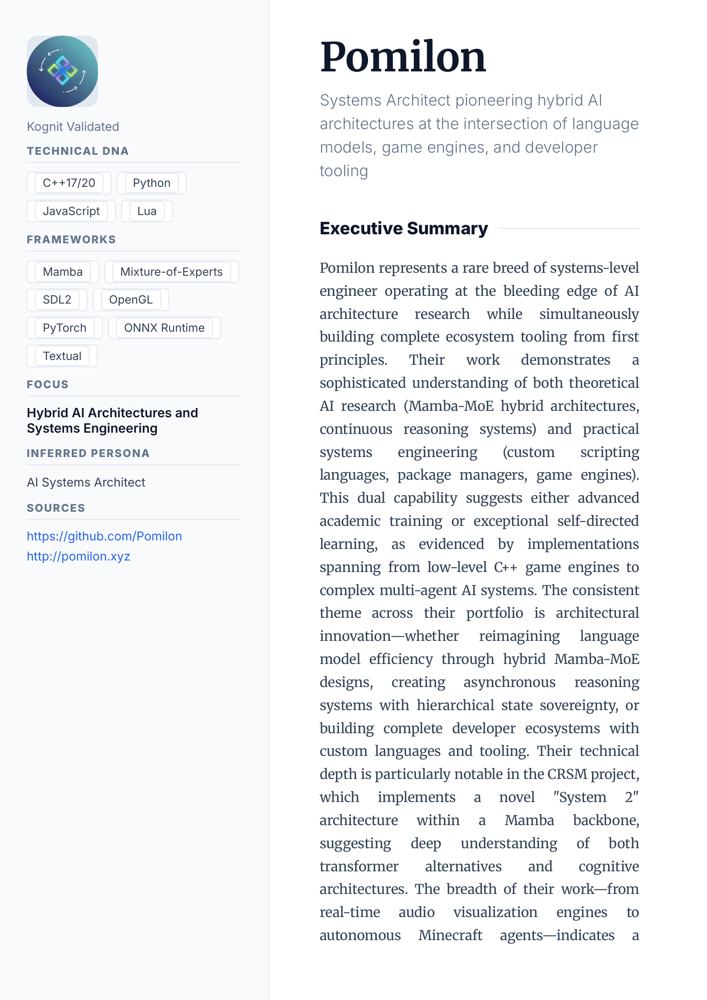
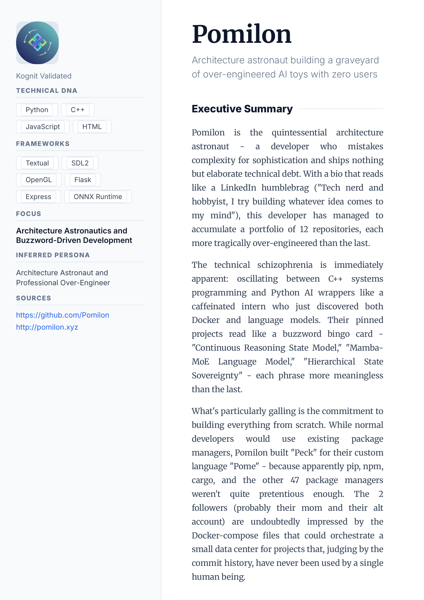
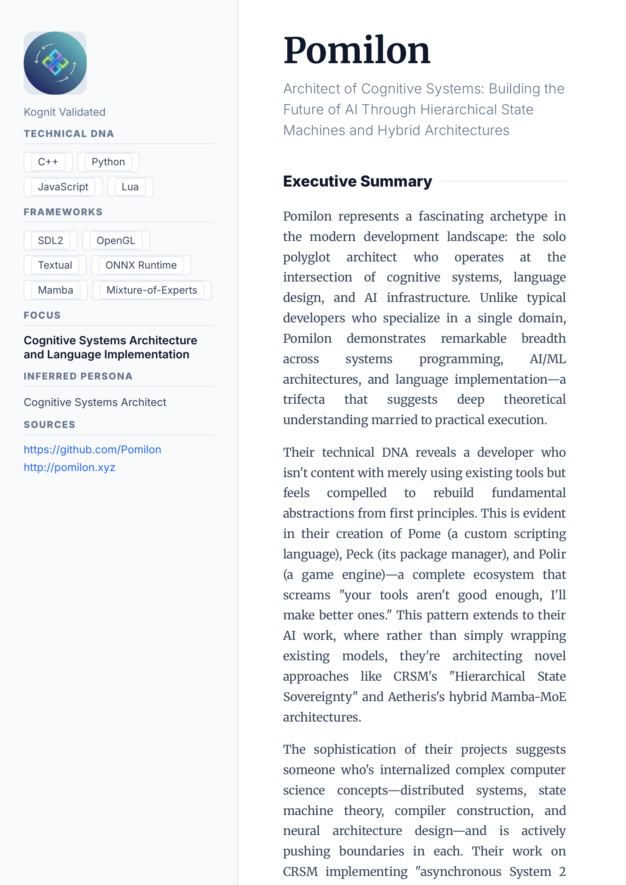

# Kognit: The Technical Biographer Agent

**Kognit** is an advanced AI orchestration layer designed to transform a developer's raw digital footprint into a professional, high-fidelity **Developer Persona Audit**. 

Unlike simple summarizers, Kognit acts as a forensic technical biographer. It recursively explores repositories, reads technical documentation, analyzes architectural patterns, and verifies external signals to construct a grounded, proof-backed narrative of a software engineer's capabilities.

## Why Kognit?

Most developer profiling tools I've encountered are either too shallow—viewing only surface-level metrics like commit counts—or simply don't provide useful, deep insights into *how* a developer thinks. They often miss the architectural decisions, the complexity of the problems solved, and the "soul" of the code.

I built Kognit for fun, as a hobby project, because I wanted a tool that could dig deeper. It's not a product; it's an experiment in agentic reasoning to see if an AI can truly understand a developer's work by reading their documentation, project structure, and technical explanations, just like a human engineer would.

---

## ⚡ Quick Start

Get a full technical audit of a GitHub profile in seconds (no API key required for browser mode):

1.  **Clone & Install:**
    ```bash
    git clone https://github.com/Pomilon/kognit.git && cd kognit
    pip install -r requirements.txt
    ```
2.  **Run (Browser Mode):**
    ```bash
    # Replace 'torvalds' with any GitHub username
    python3 entry.py torvalds --scraping-mode browser --mode deep-dive
    ```
3.  **View Report:** Open `profile.pdf`!

> **Note**: for the best results use `--model groq:moonshotai/kimi-k2-instruct-0905`.

---

## Gallery of Outputs

Kognit adapts its voice and depth to your needs. Check out these examples:

| **Professional Deep Dive** | **Roast Mode** | **Witty Summary** |
| :---: | :---: | :---: |
| <a href="examples/pomilon_review.pdf"></a> | <a href="examples/pomilon_roast.pdf"></a> | <a href="examples/pomilon_humor.pdf"></a> |
| [**View PDF Report**](examples/pomilon_review.pdf) | [**View PDF Report**](examples/pomilon_roast.pdf) | [**View PDF Report**](examples/pomilon_humor.pdf) |

> **Have a cool generation?** Share your own reports in the [Discussions tab](https://github.com/Pomilon/kognit/discussions)! I'd love to see what Kognit finds about you.

---

## Key Capabilities

### Multi-Modal Scraping ("The Probes")
- **GitHub Deep-Probe:** Connects via GraphQL (API Mode) or mimics browser behavior (Browser) to fetch comprehensive data: pinned items, contribution graphs, top repositories, and starred projects.

### Agentic Reasoning ("The Refinery")
- **Iterative Exploration (Full-Dive):** In its most powerful mode, Kognit spins up a swarm of sub-agents. A specialized "Repo Analyst" visits every key repository, deconstructing its README.md, tech stack, and complexity score in isolation before feeding insights back to the main synthesizer.
- **Architectural Inference:** The AI infers *role* and *expertise* from project structure and dependencies. (e.g., "Uses Tokio + Actix" -> "Systems Engineer specializing in async runtimes").
- **Hallucination Guardrails:** Kognit cross-checks extracted claims against raw data.

### Professional Rendering ("The Canvas")
- **PDF Generation:** Outputs a stunning, print-ready PDF using `WeasyPrint`.
- **Hybrid Layout:** Features a distinct "Persona Canvas" cover page with a sidebar for high-level metadata (Tech DNA, Focus) and a main column for the narrative.
- **Visuals:** Automatically fetches user avatars and renders LaTeX equations (via Matplotlib SVG) found in technical documentation.
- **PNG Preview:** Automatically generates a high-res PNG preview of the report's first page.

---

## Installation

### Prerequisites
- **Python 3.10+**
- **System Libraries:** Required for PDF generation (`WeasyPrint` and `pdf2image`).
  - **Linux (Debian/Ubuntu):** `sudo apt-get install python3-pip python3-cffi python3-brotli libpango-1.0-0 libpangoft2-1.0-0 libharfbuzz0b libpangocairo-1.0-0 poppler-utils`
  - **macOS:** `brew install weasyprint poppler`

### Setup
1. **Clone the repository:**
   ```bash
   git clone https://github.com/Pomilon/kognit.git
   cd kognit
   ```

2. **Install Python dependencies:**
   ```bash
   pip install -r requirements.txt
   ```

3. **Configure Environment:**
   Create a `.env` file in the root directory. You need at least one LLM provider key.
   ```env
   # Primary LLM (Google Gemini)
   GOOGLE_API_KEY=your_gemini_key
   
   # Optional: For High-Speed Inference (Recommended)
   GROQ_API_KEY=your_groq_key
   
   # Optional: For OpenAI models
   OPENAI_API_KEY=your_openai_key
   
   # Optional: GitHub Token (Increases API limits, prevents rate-limiting)
   GITHUB_TOKEN=your_github_pat
   ```

---

## Usage

### Basic Profiling
Generate a standard biography PDF for a user (e.g., `torvalds`).
```bash
python3 entry.py torvalds --output torvalds_profile.pdf
```

### Modes of Operation

Kognit supports different levels of depth via the `--mode` flag:

#### 1. Summary Mode (Default)
Fast, high-level overview. Good for quick intros.
```bash
python3 entry.py pomilon --mode summary
```

#### 2. Deep Dive (`--mode deep-dive`)
Fetches READMEs for the top 10 repositories to perform a technical audit. Analyzes code quality, testing standards, and architecture based on documentation.
```bash
python3 entry.py pomilon --mode deep-dive
```

#### 3. Full Dive (`--mode full-dive`) **(Recommended)**
The "God Mode". Activates the **Explorer Agent**. Kognit will iteratively analyze up to 20 repositories individually, generating a massive, consolidated "Technical Audit" report appended to the PDF. This mode bypasses context window limits by processing repos serially.
```bash
python3 entry.py pomilon --mode full-dive --model groq:llama-3.3-70b-versatile
```

### Tone & Humor

You can adjust the personality of the agent:

- **Humor Level (`--humor 0-100`):** From 0 (Professional) to 100 (Stand-up Comedy).
  ```bash
  python3 entry.py pomilon --humor 60 --output pomilon_witty.pdf
  ```

- **Roast Mode (`--roast`):** ruthlessly critiques tech choices, over-engineering, and bio fluff.
  ```bash
  python3 entry.py pomilon --roast --output pomilon_roasted.pdf
  ```

---

## Architecture

Kognit is built on a modular, agentic architecture:

1.  **Probes (`kognit/probes`):**
    *   **GithubProbe:** Handles GraphQL (API) or BeautifulSoup (Browser) extraction.
    *   **Normalizer:** Flattens complex nested JSON into a dense, searchable Markdown context.
    
2.  **Refinery (`kognit/refinery`):**
    *   **Engine:** The PydanticAI-powered LLM loop.
    *   **Validator:** Post-processing logic to verify links and data integrity.
    
3.  **Explorer (`kognit/agent/explorer.py`):**
    *   A sub-agent specialized in code auditing. It runs independent cycles for each repository found during the Full-Dive.

4.  **Renderer (`kognit/renderer`):**
    *   **Jinja2 Engine:** Hydrates the `biography.html` template.
    *   **Latex2SVG:** Renders math equations using Matplotlib for PDF compatibility.
    *   **WeasyPrint:** Converts the final HTML canvas into a paginated PDF.

---

## Disclaimer & Ethics

**IMPORTANT: READ BEFORE USE**

Kognit is a tool built for **humor, self-reflection, and personal technical auditing**. It utilizes publicly available data from GitHub to generate creative personas and technical narratives. 

### Ethical Responsibility
By using this tool, you agree to the following:
1.  **Anti-Stalking Policy:** This tool must **NOT** be used to harass, stalk, or gather information for malicious intent. It is strictly limited to public GitHub technical footprints.
2.  **No Automated Screening:** This report should **NOT** be used as a primary or automated filter for hiring decisions or professional evaluations. AI-generated personas can be biased, inaccurate, or prioritize narrative over fact.
3.  **Subjectivity Warning:** The "Roast" mode is designed to be critical and satirical. If the feedback stings, **that is the point**. It is intended for amusement and lighthearted self-critique.
4.  **Liability:** I am not responsible for any misuse of the generated reports, or for any social or professional consequences arising from the use of this tool. You assume all responsibility for the ethical use of the data you process.

Use this tool with respect for your peers and the open-source community.

---

## Contributing

Contributions are welcome! Please feel free to submit a Pull Request.

1.  Fork the project.
2.  Create your feature branch (`git checkout -b feature/AmazingFeature`).
3.  Commit your changes (`git commit -m 'Add some AmazingFeature'`).
4.  Push to the branch (`git push origin feature/AmazingFeature`).
5.  Open a Pull Request.

## License

Distributed under the MIT License. See `LICENSE` for more information.
